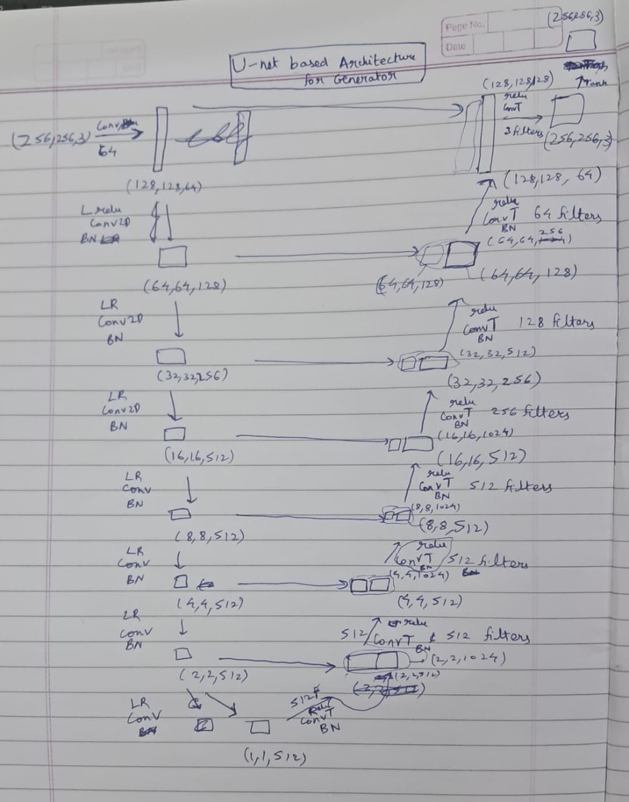
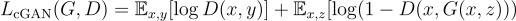

This repository implements the Pix2Pix architecture using Pytorch.

I have used a U-net based architecture for the Generator model and PatchGAN for the Discriminator model.

# Some Keypoints from the paper on Pix2Pix (Image-to-Image Translation with Conditional Adversarial Networks)

1. Conditional Gans not only learn the mapping from input image to output image, 
but also learn a loss function to train this mapping. So we can use the same architecture for 
solving multiple problems by training the model on different datasets. Traditionally they would 
require different loss functions for different problems.

This is because the loss function of the CGAN involves the D(x,y) and G(x,z) which
are basically the generator and discriminator model which are trained on the data and 
get updated after training. Hence for each of the problems it learns different loss functions.

